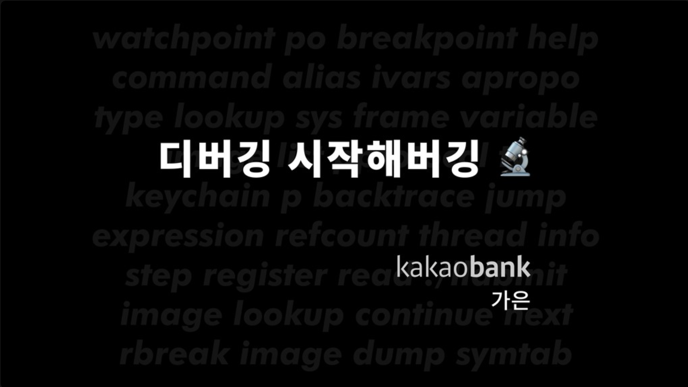

# LLDB-Study-Links
LLDB를 공부하기 위한 강좌, 블로그, 책을 추천합니다.

1. 강좌
2. 블로그
3. 책

## 강좌

- [LLDB 정복 - 가은](https://yagom.net/courses/start-lldb/)

동영상 X

- [디버깅 시작해버깅 - 가은](https://www.youtube.com/watch?v=2lwWggsYeXU)

## 블로그

- [Apple LLDB Debugging Guide](https://developer.apple.com/library/archive/documentation/General/Conceptual/lldb-guide/chapters/Introduction.html#//apple_ref/doc/uid/TP40016717-CH1-DontLinkElementID_42)

- [[Xcode][LLDB]Debugging With Xcode and LLDB - 민소네](https://minsone.github.io/ios/mac/xcode-lldb-debugging-with-xcode-and-lldb)

#### Chisel

- [[Xcode][LLDB]Debugging With Xcode, LLDB and Chisel - 민소네]([Xcode][LLDB]Debugging With Xcode, LLDB and Chisel)

## 책

- Advanced apple debugging & reverse engineering

